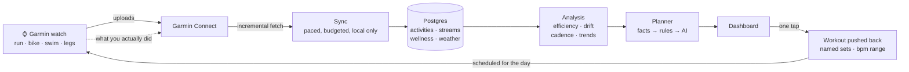
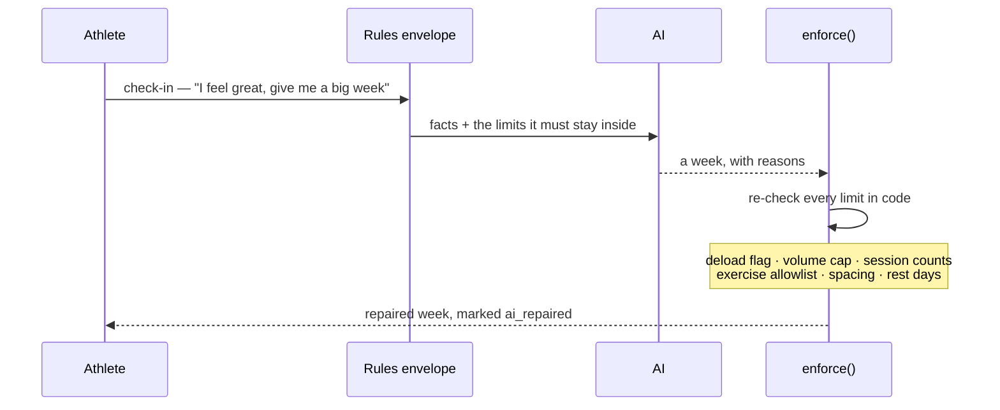

# Aerobic Engine

**Endurance training analytics and an adaptive weekly planner, built on your own
Garmin data — and it runs for nothing.**

**Live: [aerobic-engine.streamlit.app](https://aerobic-engine.streamlit.app)**

One athlete's real data, read-only. The dashboard is open; changing anything —
syncing, logging, sending a workout to the watch — needs a PIN.

Every part of the stack is a free tier, and not the crippled kind:

| Piece | What it costs |
|---|---|
| Hosting — Streamlit Community Cloud | free |
| Database — Neon Postgres | free, 0.5 GB, scales to zero |
| AI — Gemini | free, ~1500 requests a day |
| AI fallback — Groq | free, no card |
| Garmin data | you already own it |

No card, no trial clock, no per-seat anything. The AI layer is also optional:
switch it off and the planner still produces a full week from the rules alone —
the guardrails are the product, and they are deterministic.

**The free tiers are not a compromise here, they are a fit.** A planning call is
one chunky ~2.5K-token request a day, and the chart summaries are a dozen short
ones after each sync. That shape sits comfortably inside a requests-per-day
allowance, which is why Gemini leads and Groq backs it up: summaries fan out
across both providers, so one rate-limiting hands its work to the other instead
of pausing. Measured: fourteen summaries in 5.8 seconds.

It answers one question properly — *am I getting faster at the same heart
rate?* — and then plans the rest of the week around the answer, across swim,
bike, run and leg strength, and sends each session to the watch.

Rules first, AI second. A language model adjusts volume, intensity and placement;
it cannot talk its way past a deload, invent an exercise, or exceed the weekly
progression cap, because those are enforced in code after the model answers.

> Personal project, single user, built for my own training. Not affiliated
> with or endorsed by Garmin.
> Not medical advice.

---

## What it takes as input

**Garmin Connect**, via the unofficial [`garminconnect`](https://github.com/cyberjunky/python-garminconnect)
library, pulled with your own credentials into a local database:

- **Activities** — run, bike, pool and open-water swim, strength, and multisport
  (split into its individual legs, because the parent record carries no heart rate)
- **Heart-rate streams** per session, downsampled, so aerobic drift can be
  recomputed without re-fetching
- **Time in each heart-rate zone** per session — the strongest available signal
  for whether a session was actually easy
- **Daily wellness** — resting heart rate, overnight HRV, VO2max, Training
  Readiness, sleep, body battery
- **Thresholds** — lactate-threshold heart rate, running and cycling FTP
- **Strength sets** recorded in the watch's strength mode, mapped into the app's
  exercise library and logged automatically

Plus your own input: a daily check-in (sleep, soreness, motivation, time
available, free text) and weekly targets per sport.

## What it tells you

- **Efficiency factor** per sport — speed or watts per heartbeat — trended over
  *steady aerobic sessions only*, because mixing in intervals makes the trend
  track how hard you trained rather than how fit you are
- **Aerobic drift** on long sessions: efficiency in the second half versus the first
- **Where your effort actually goes** — the easy/moderate/hard split, against a
  base-phase target of 70%+ easy
- **Whether the engine is improving** — resting HR and HRV baselines, 28 days
  against the 28 before
- **A plan for the rest of the week** that responds to recovery data, and a
  plain-English summary of every page so you needn't read the charts

## How it works

The loop the athlete lives in. Every arrow is something that already happens —
nothing here is planned work.



The last two arrows are the part that makes it a loop rather than a report: the
plan goes back to the watch as a real workout, and what you do against it comes
back in on the next sync.

## Architecture

Layers, and what each one is not allowed to do. The rules layer is the reason
this is not a chat wrapper.

```mermaid
flowchart TD
    subgraph UI["app/ — thin, no logic"]
        SA["streamlit_app.py"]
        UIM["ui.py<br/>design system"]
    end

    subgraph CORE["core/ — pure Python, no Streamlit"]
        GC["garmin_client.py<br/>fetch + parse"]
        GG["garmin_guard.py<br/>pacing · budgets · breaker"]
        GW["garmin_workout.py<br/>push to watch"]
        ST["store.py<br/>Postgres / SQLite"]
        AN["analysis.py<br/>deterministic maths"]
        PL["planner.py<br/>facts + rules + enforce"]
        STR["strength.py<br/>closed exercise library"]
        AI["ai.py<br/>the only module<br/>that knows an LLM"]
        AU["auth.py<br/>read + write PINs"]
    end

    EXT["Gemini / Groq"]

    SA --> ST & AN & PL & GW & AU
    GC --> GG
    GC --> ST
    PL --> AN
    PL --> STR
    PL --> AI
    AI -.->|"JSON in, JSON out"| EXT
    AI -.->|"answer re-checked<br/>by planner.enforce()"| PL

    style AI fill:#2d2a4a,stroke:#7FB6DC
    style PL fill:#1e3a32,stroke:#3FB68B
    style EXT fill:#3a2a2a,stroke:#DB5F5A
```



Two invariants hold this together, and both are enforced rather than intended:
nothing under `core/` imports Streamlit, and only `core/ai.py` names a provider.
So the training logic is testable without a browser, and the guardrails are
testable without a network.



A model asked how your training should go will agree with you. That is why the
answer is checked again after it arrives, and why the explanation gets rewritten
when the numbers no longer support it.

## Design

Three layers, in this order:

1. **Facts** — deterministic analysis of what you actually did (`core/analysis.py`)
2. **Rules envelope** — the non-negotiables: 10%/week volume cap, deload every
   fourth week or whenever recovery says so, session counts, required long
   sessions, minimum rest days, and where leg strength may be placed
   (`core/planner.py`)
3. **The AI** — adjusts inside that envelope and explains each choice
   (`core/ai.py`)

Then `planner.enforce()` re-checks every constraint **in code**. A prompt is not a
guardrail: a raw model is sycophantic — say "I feel great" and it hands you a
reckless week. `tests/test_guardrails.py` feeds the enforcement layer a
deliberately reckless plan (Z5 intervals during a deload, invented plyometrics,
three leg days, no rest day, 1485 minutes against a 229-minute budget) and asserts
that none of it survives.

Nothing under `core/` imports Streamlit, and only `core/ai.py` knows a language
model exists. That is what makes the training logic testable at all — the
guardrail suite drives the planner directly, with no UI in the way.

## Running it

```bash
python3 -m venv .venv && source .venv/bin/activate
pip install -r requirements.txt
cp .env.example .env          # add your Garmin credentials
python scripts/set_pin.py     # PIN for write actions
python scripts/fetch.py --days 45
streamlit run app/streamlit_app.py
```

The fetch needs a Garmin login and runs locally. The dashboard is read-only
against the database.

| Flag | |
| --- | --- |
| `--days N` | re-scan the last N days |
| `--full` | all available history |
| `--metrics-only` | recompute efficiency/zones/drift, no network |
| `--refresh-wellness` | re-pull wellness already stored |
| `--guard-status` | show request budgets and breaker state |

## The AI layer is optional, and can be free

`AI_BACKEND=none` gives the rules-only plan, which is a complete, usable week on
its own. For the adaptive layer, the written page summaries and the per-chart
readings, the cheapest good option is **Groq's free tier** — no card, and
`openai/gpt-oss-120b` is a capable 131K-context model with guaranteed JSON output:

```bash
# key from https://console.groq.com/keys
AI_BACKEND=groq
GROQ_API_KEY=gsk_...
```

Summaries and chart readings are generated **once per Garmin sync** and stored in
the database, not on page render. That matters more than it sounds: Streamlit runs
the body of every tab on every render, so inline AI calls fired ten times per page
load and took it from 1.5 seconds to 92. Generation is paced to the interval the
provider asks for, and a 429 moves to the next model in the chain because quotas
are metered per model.

The free plan's binding limit is **8,000 tokens per minute** (plus 30 requests a
minute, 1,000 a day). A planner call is around 2,500 tokens, so that is
comfortable — summaries and chart captions are cached for 30–60 minutes so a page
reload does not spend the budget, and a 429 falls back to the rules plan rather
than retrying into the next minute's allowance.

Groq, Gemini, Cerebras and OpenRouter all speak the OpenAI chat-completions
dialect, so switching between them is config rather than code:

| `AI_BACKEND` | Default model | Free tier, and its shape |
| --- | --- | --- |
| `gemini` | `gemini-3.6-flash` | ~1500 requests/day, 1M context. Caps *requests*, not tokens — the best fit here, because each planner call is chunky. |
| `cerebras` | `gpt-oss-120b` | ~1M tokens/day. The largest token budget; also enforces JSON schemas. |
| `groq` | `openai/gpt-oss-120b` | 30 req/min, 1000/day, **8K tokens/min**. Fastest, but the per-minute token cap is the one you feel. |
| `openrouter` | `…:free` variants | Many free models behind one key; limits vary per model. |

For an unlisted provider that speaks the same dialect, set `AI_BASE_URL`,
`AI_API_KEY` and `AI_MODEL_OVERRIDE` and leave the code alone.

Each provider carries a **model fallback chain**, because the newest model is
reliably the busiest: probed live, `gemini-3.7-flash` and `gemini-flash-latest`
returned 503 while `gemini-3.6-flash` answered in three seconds, and
`gemini-2.5-flash` is retired (404). A 503 or a 404 moves to the next model in
the chain; a 429 or an auth failure does not, because retrying a rate limit only
spends the next minute's budget. Setting a model explicitly disables the chain.

Two things that cost real debugging time, recorded so they do not have to again:
these APIs sit behind Cloudflare and reject `urllib`'s default user agent with a
**403 that looks exactly like a bad API key**; and Gemini 3.x spends tokens on
internal reasoning before emitting anything, so a `max_tokens` that looks
generous can return an empty response with `finish_reason: length`.

Also behind the same interface: `anthropic` (API key), `cerebras`,
`openrouter` and `azure` (AI Foundry). `AI_BACKEND` accepts a chain such as
`gemini,groq`, and the chart summaries fan out across every provider in it,
so one that rate-limits hands its summary to another instead of pausing.

## Being a good citizen with an unofficial API

Garmin publishes no rate limits, is stricter with datacenter IPs than home ones,
and does lock accounts. Every request therefore goes through `core/garmin_guard.py`:

- **Pacing and budgets** — a minimum gap between calls, hourly and daily ceilings
- **A circuit breaker** — one 429 stops everything for an hour; `Retry-After` is
  honoured only when it asks for *longer*
- **Single-flight** — one sync at a time plus a cooldown, so a Refresh button
  cannot be double-clicked into a burst
- **No SSO from a host** — a deployed instance resumes an exported session and
  runs with password login disabled

All of that state lives in the database, so a restart or a redeploy does not reset
it. 12 tests cover it.

## Security

Writes are PIN-gated (salted PBKDF2-SHA256, constant-time comparison, lockout with
exponential backoff persisted server-side); the PIN itself is never stored.
Credentials, tokens and the database are gitignored and never leave the machine
that fetches. See [DEPLOY.md](DEPLOY.md).

## Tests

```bash
pip install -r requirements-dev.txt
python -m pytest tests -q
```

60 tests: guardrails, analysis maths, the rate guard, PIN security, and the
SQLite→Postgres dialect translation.

## Documentation

- [CLAUDE.md](CLAUDE.md) — the full build brief and design rationale, including
  everything the first real Garmin sync got wrong
- [DEPLOY.md](DEPLOY.md) — hosting it, with the account-safety measures explained
