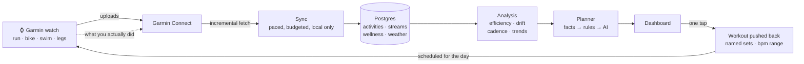
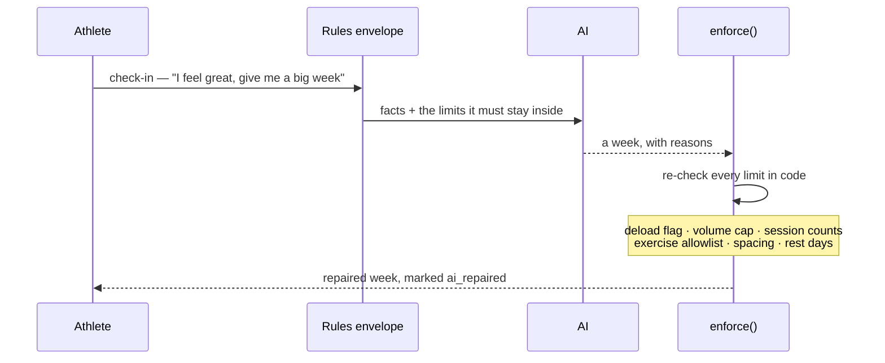

# Aerobic Engine

**Endurance training analytics and an adaptive weekly planner, built on your own
Garmin data — and it runs for nothing.**

**Live: [aerobic-engine.streamlit.app](https://aerobic-engine.streamlit.app)**

One athlete's real data, read-only. The dashboard is open; changing anything —
syncing, logging, sending a workout to the watch — needs a PIN.

Every part of the stack is a free tier, and not the crippled kind:

| Piece | What it costs |
|---|---|
| Hosting — Streamlit Community Cloud | free |
| Database — Neon Postgres | free, 0.5 GB, scales to zero |
| AI — Gemini | free, ~1500 requests a day |
| AI fallback — Groq | free, no card |
| Garmin data | you already own it |

No card, no trial clock, no per-seat anything. The AI layer is also optional:
switch it off and the planner still produces a full week from the rules alone —
the guardrails are the product, and they are deterministic.

**The free tiers are not a compromise here, they are a fit.** A planning call is
one chunky ~2.5K-token request a day, and the chart summaries are a dozen short
ones after each sync. That shape sits comfortably inside a requests-per-day
allowance, which is why Gemini leads and Groq backs it up: summaries fan out
across both providers, so one rate-limiting hands its work to the other instead
of pausing. Measured: fourteen summaries in 5.8 seconds.

It answers one question properly — *am I getting faster at the same heart
rate?* — and then plans the rest of the week around the answer, across swim,
bike, run and leg strength, and sends each session to the watch.

Rules first, AI second. A language model adjusts volume, intensity and placement;
it cannot talk its way past a deload, invent an exercise, or exceed the weekly
progression cap, because those are enforced in code after the model answers.

> Personal project, single user, built for my own training. Not affiliated
> with or endorsed by Garmin.
> Not medical advice.

---

## What it takes as input

**Garmin Connect**, via the unofficial [`garminconnect`](https://github.com/cyberjunky/python-garminconnect)
library, pulled with your own credentials into a local database:

- **Activities** — run, bike, pool and open-water swim, strength, and multisport
  (split into its individual legs, because the parent record carries no heart rate)
- **Heart-rate streams** per session, downsampled, so aerobic drift can be
  recomputed without re-fetching
- **Time in each heart-rate zone** per session — the strongest available signal
  for whether a session was actually easy
- **Daily wellness** — resting heart rate, overnight HRV, VO2max, Training
  Readiness, sleep, body battery
- **Thresholds** — lactate-threshold heart rate, running and cycling FTP
- **Strength sets** recorded in the watch's strength mode, mapped into the app's
  exercise library and logged automatically

Plus your own input: a daily check-in (sleep, soreness, motivation, time
available, free text) and weekly targets per sport.

## What it tells you

- **Heart rate at your usual pace** — the headline. Each session's efficiency
  expressed as the heart rate it implies at your median pace, so sessions of
  different speeds are comparable and a falling line is unambiguous progress
- **Efficiency factor** per sport — speed or watts per heartbeat — trended over
  *steady aerobic sessions only*, because mixing in intervals makes the trend
  track how hard you trained rather than how fit you are
- **Aerobic drift**, two ways: efficiency in the second half of a long session
  versus the first, and — for sessions too short to halve — heart rate across
  laps held at the same pace, which is the version that works from week one
- **Where your effort actually goes** — the easy/moderate/hard split against a
  base-phase target of 70%+ easy, recounted from your own stored samples so it
  follows *your* aerobic ceiling rather than Garmin's fixed zone 2
- **Whether the mix is drifting** — the same split week by week, because a base
  block slides into accidental tempo work a few minutes at a time
- **The load ramp** — daily load with its 7-day and 28-day averages and the
  ratio between them, because a single acute:chronic number cannot say which way
  it is moving
- **Cadence and stride**, ground contact and vertical ratio, against the
  overstriding threshold
- **Heat** — heart rate at a reference pace against dew point, so a bad session
  in humidity is read as weather rather than lost fitness
- **Whether the engine is improving** — resting HR and HRV baselines, 28 days
  against the 28 before, plus Garmin's own race predictions plotted as pace
- **Showing up** — sixteen weeks as a calendar, because endurance is mostly an
  attendance problem and a gap is invisible in a line chart
- **A plan for the rest of the week** that responds to recovery data, a
  plain-English summary at the top of every page, a sentence under every chart,
  and a coach you can ask a question in your own words

## The pages

| Page | Answers |
| --- | --- |
| **Today** | What do I do now — the session, a written reading, this week at a glance, and a coach you can ask |
| **Progress** | Is it working — heart rate at pace, intensity mix, load ramp, cadence, drift, heat |
| **Plan** | The week — check in, see it, edit any row, send it to the watch |
| **Rules** | Your settings — session floors, growth cap, deload cadence, zones, weekly targets, and the limits you cannot move |
| **Lifetime** | How far you have come — totals, race predictions, records, every day you showed up |
| **Log** | The record — sessions and splits, leg work, raw tables, and the app's own errors |

## How it works

The loop the athlete lives in. Every arrow is something that already happens —
nothing here is planned work.



The last two arrows are the part that makes it a loop rather than a report: the
plan goes back to the watch as a real workout, and what you do against it comes
back in on the next sync.

## Architecture

Layers, and what each one is not allowed to do. The rules layer is the reason
this is not a chat wrapper.

```mermaid
flowchart TD
    subgraph UI["app/ — thin, no logic"]
        SA["streamlit_app.py"]
        UIM["ui.py<br/>design system"]
        FR["freshness.py<br/>survive a deploy"]
    end

    subgraph CORE["core/ — pure Python, no Streamlit"]
        GC["garmin_client.py<br/>fetch + parse"]
        GG["garmin_guard.py<br/>pacing · budgets · breaker"]
        GW["garmin_workout.py<br/>push to watch"]
        ST["store.py<br/>Postgres / SQLite"]
        AN["analysis.py<br/>deterministic maths"]
        PL["planner.py<br/>facts + rules + enforce"]
        STR["strength.py<br/>closed exercise library"]
        RU["rules.py<br/>the editable half<br/>of the envelope"]
        AI["ai.py<br/>the only module<br/>that knows an LLM"]
        AU["auth.py<br/>read + write PINs"]
        AL["applog.py<br/>errors into the database"]
        SI["strava_import.py<br/>history, walled off<br/>from the AI"]
    end

    EXT["Gemini / Groq"]

    SA --> ST & AN & PL & GW & AU & AL
    FR -.->|"reload after a deploy"| SA
    GC --> GG
    GC --> ST
    SI --> ST
    PL --> AN
    PL --> STR
    PL --> RU
    PL --> AI
    AI -.->|"JSON in, JSON out"| EXT
    AI -.->|"answer re-checked<br/>by planner.enforce()"| PL

    style AI fill:#2d2a4a,stroke:#7FB6DC
    style PL fill:#1e3a32,stroke:#3FB68B
    style EXT fill:#3a2a2a,stroke:#DB5F5A
```



Two invariants hold this together, and both are enforced rather than intended:
nothing under `core/` imports Streamlit, and only `core/ai.py` names a provider.
So the training logic is testable without a browser, and the guardrails are
testable without a network.



A model asked how your training should go will agree with you. That is why the
answer is checked again after it arrives, and why the explanation gets rewritten
when the numbers no longer support it.

## Design

Three layers, in this order:

1. **Facts** — deterministic analysis of what you actually did (`core/analysis.py`)
2. **Rules envelope** — the non-negotiables: volume cap, deload cadence, session
   counts, required long sessions, minimum rest days, endurance sessions spaced a
   day apart, and where leg strength may be placed (`core/planner.py`)

   Half of those are the athlete's to set, and visible on the Rules page:
   endurance sessions a week, leg sessions, rest days, the growth cap, weeks per
   block, the deload cut, brick frequency, spacing on or off. They live in
   `core/rules.py`, stored one key per rule and clamped to a sane range on the way
   in — because a settings page is a very good way to talk yourself into a 40%
   jump.

   The other half is not, and the page says so: the deload triggers (HRV below
   baseline, resting HR above it, readiness under 35, load ratio over 1.3), the
   fixed exercise library, the hard-session cap, no plyometrics in base. "You
   cannot change this" is itself information.
3. **The AI** — adjusts inside that envelope and explains each choice
   (`core/ai.py`)

Then `planner.enforce()` re-checks every constraint **in code**. A prompt is not a
guardrail: a raw model is sycophantic — say "I feel great" and it hands you a
reckless week. `tests/test_guardrails.py` feeds the enforcement layer a
deliberately reckless plan (Z5 intervals during a deload, invented plyometrics,
three leg days, no rest day, 1485 minutes against a 229-minute budget) and asserts
that none of it survives.

Nothing under `core/` imports Streamlit, and only `core/ai.py` knows a language
model exists. That is what makes the training logic testable at all — the
guardrail suite drives the planner directly, with no UI in the way.

## A race, and the phases before it

Set a date on the Rules page and the envelope stops treating every week the same:

| Phase | When | What changes |
| --- | --- | --- |
| **Base** | until 13 weeks out | easy volume, intensity on a leash |
| **Build** | 12 → 5 weeks out | a hard session earns its way in, long sessions grow 10% |
| **Peak** | 4 → 3 weeks out | the hardest weeks; volume holds rather than rising |
| **Taper** | last 1–3 weeks | volume cut 45%, sharpness kept, an extra rest day |

The taper length comes from the distance — three weeks for a marathon, two for a
half, one for anything shorter — because that is what a taper is for.

Two things it will not do. A phase never lifts a safety rule: a deload triggered
by recovery data still strips the quality out of a peak week, which a test
asserts directly. And with no race set, every week is a base week — the behaviour
before goals existed, and the right answer while you are building an engine.

## A message when you wake up

`scripts/notify.py` sends the day's session — what, how long, the heart-rate
range, and why — composed from the plan that already exists, so it costs no
model call. `NOTIFY_BACKEND` picks how it leaves the machine:

- **`telegram`** — a bot token and a chat id. Ten minutes end to end, no
  approval, no message window.
- **`whatsapp`** — Meta's Cloud API with your own number. Note the shape of it
  before wiring it up: a free-form message only sends inside 24 hours of *you*
  messaging the number, and outside that window it must be an approved template
  (`WHATSAPP_TEMPLATE`). Meta retired the 1,000-free-conversations model in July
  2025; what is free now is the service window, not a monthly quota.
- **`callmebot`** — WhatsApp without a Meta app at all, at the cost of a third
  party handling the text of your training.
- **`none`** — the default. Nothing is sent.

```bash
python scripts/notify.py --dry-run     # print it, send nothing
```

## What goes back to the watch

The plan is not a suggestion you then re-enter by hand:

- **Runs and rides** are pushed as timed workouts with your heart-rate range
  attached, so the watch holds you to the ceiling you set
- **Leg sessions** are pushed with every exercise, set, rep, hold and weight,
  named — which matters because the watch counts reps well and usually does not
  know which exercise it is watching. Every Garmin exercise name in the mapping
  was verified by uploading a workout and reading it back: a name Garmin does not
  recognise is silently blanked, and the watch then shows the bare category, so a
  tibialis raise displayed as "Calf raise" — the muscle it exists to balance
- **Finished sessions are removed**, from the saved list *and* the training
  calendar, because a workout is pushed most days and Garmin keeps every one of
  them until something deletes it
- **Swims and bricks stay off the watch** — a Garmin swim workout is built from
  pool length and stroke rather than minutes, and wrist heart rate in water is
  not reliable enough to hold you to

Sets come back on the next sync, mapped into the exercise library, and the
weights progress from what was actually logged. Where the watch could not name a
set, the Log page lets you assign it, and that assignment survives every later
re-import.

## Running it

```bash
python3 -m venv .venv && source .venv/bin/activate
pip install -r requirements.txt
cp .env.example .env          # add your Garmin credentials
python scripts/set_pin.py     # PIN for write actions
python scripts/fetch.py --days 45
streamlit run app/streamlit_app.py
```

The fetch needs a Garmin login and runs locally. The dashboard is read-only
against the database.

| Flag | |
| --- | --- |
| `--days N` | re-scan the last N days |
| `--full` | all available history |
| `--metrics-only` | recompute efficiency/zones/drift, no network |
| `--refresh-wellness` | re-pull wellness already stored |
| `--guard-status` | show request budgets and breaker state |

## The AI layer is optional, and can be free

`AI_BACKEND=none` gives the rules-only plan, which is a complete, usable week on
its own. For the adaptive layer, the written page summaries and the per-chart
readings, the cheapest good option is **Groq's free tier** — no card, and
`openai/gpt-oss-120b` is a capable 131K-context model with guaranteed JSON output:

```bash
# key from https://console.groq.com/keys
AI_BACKEND=groq
GROQ_API_KEY=gsk_...
```

Summaries and chart readings are generated **once per Garmin sync** and stored in
the database, not on page render. That matters more than it sounds: Streamlit runs
the body of every tab on every render, so inline AI calls fired ten times per page
load and took it from 1.5 seconds to 92. Generation is paced to the interval the
provider asks for, and a 429 moves to the next model in the chain because quotas
are metered per model.

The free plan's binding limit is **8,000 tokens per minute** (plus 30 requests a
minute, 1,000 a day). A planner call is around 2,500 tokens, so that is
comfortable — summaries and chart captions are cached for 30–60 minutes so a page
reload does not spend the budget, and a 429 falls back to the rules plan rather
than retrying into the next minute's allowance.

Groq, Gemini, Cerebras and OpenRouter all speak the OpenAI chat-completions
dialect, so switching between them is config rather than code:

| `AI_BACKEND` | Default model | Free tier, and its shape |
| --- | --- | --- |
| `gemini` | `gemini-3.6-flash` | ~1500 requests/day, 1M context. Caps *requests*, not tokens — the best fit here, because each planner call is chunky. |
| `cerebras` | `gpt-oss-120b` | ~1M tokens/day. The largest token budget; also enforces JSON schemas. |
| `groq` | `openai/gpt-oss-120b` | 30 req/min, 1000/day, **8K tokens/min**. Fastest, but the per-minute token cap is the one you feel. |
| `openrouter` | `…:free` variants | Many free models behind one key; limits vary per model. |

For an unlisted provider that speaks the same dialect, set `AI_BASE_URL`,
`AI_API_KEY` and `AI_MODEL_OVERRIDE` and leave the code alone.

Each provider carries a **model fallback chain**, because the newest model is
reliably the busiest: probed live, `gemini-3.7-flash` and `gemini-flash-latest`
returned 503 while `gemini-3.6-flash` answered in three seconds, and
`gemini-2.5-flash` is retired (404). A 503 or a 404 moves to the next model in
the chain; a 429 or an auth failure does not, because retrying a rate limit only
spends the next minute's budget. Setting a model explicitly disables the chain.

Two things that cost real debugging time, recorded so they do not have to again:
these APIs sit behind Cloudflare and reject `urllib`'s default user agent with a
**403 that looks exactly like a bad API key**; and Gemini 3.x spends tokens on
internal reasoning before emitting anything, so a `max_tokens` that looks
generous can return an empty response with `finish_reason: length`.

Also behind the same interface: `anthropic` (API key), `cerebras`,
`openrouter` and `azure` (AI Foundry). `AI_BACKEND` accepts a chain such as
`gemini,groq`, and the chart summaries fan out across every provider in it,
so one that rate-limits hands its summary to another instead of pausing.

## Importing history from a Strava export

Garmin is the sensor layer and stays that way, but a watch has a start date and
your running does not. If you were on Strava first, that history is otherwise
simply missing from every lifetime total.

```bash
# Strava → Settings → My Account → Download or Delete Your Account →
# Request your archive. It arrives by email as a zip.

python scripts/import_strava.py --zip export_12345678.zip --dry-run
python scripts/import_strava.py --zip export_12345678.zip
```

The dry run prints exactly what would happen and writes nothing:

```
  import         48
  duplicates      6
  other sports   24
  2025-02-13 to 2026-08-16
  bike        5 sessions ·    32.2 km ·   1.9 h
  run        43 sessions ·   192.1 km ·  24.5 h
```

Four things it gets right, each of which is a way the import can quietly corrupt
the data it is adding:

- **The export's clock is UTC** while Strava's own titles are local, which is how
  a 12:40 row is called "Evening Run". Timestamps are converted with `--tz`
  (default `Asia/Kolkata`), because without it every session after 18:30 lands on
  the wrong day and every weekly total moves with it.
- **The recent weeks are already in Garmin.** Anything that synced from the watch
  appears in both services; matching is on sport and start time within ten
  minutes. Ten because in a real export every genuine overlap matched the stored
  Garmin activity *to the second*, while a wider window started merging two short
  runs on the same evening into one.
- **Walks are left out** by default. They map to a `walk` sport and adding two
  dozen of them to a lifetime aerobic total makes the number mean less, not more.
  `--sports run,bike,swim,strength,walk` includes them.
- **Imported rows never reach the AI layer.** Strava's terms forbid their data
  being used with a language model and every planning decision here goes through
  one, so each row carries `source="strava"` and `Store.activities()` excludes
  them unless a caller explicitly asks. The only callers that ask are the
  lifetime totals and the log.

That boundary is also why the sync's own queries carry the same filter. Without
it, 48 imported activities joined the "needs weather" and "needs laps" queues and
the next sync would have spent 92 requests asking Garmin about sessions it has
never heard of.

Safe to run twice: rows are keyed on the Strava activity id, so a second run
reports everything as a duplicate and changes nothing.

## Being a good citizen with an unofficial API

Garmin publishes no rate limits, is stricter with datacenter IPs than home ones,
and does lock accounts. Every request therefore goes through `core/garmin_guard.py`:

- **Pacing and budgets** — a minimum gap between calls, hourly and daily ceilings
- **A circuit breaker** — one 429 stops everything for an hour; `Retry-After` is
  honoured only when it asks for *longer*
- **Single-flight** — one sync at a time plus a cooldown, so a Refresh button
  cannot be double-clicked into a burst
- **No SSO from a host** — a deployed instance resumes an exported session and
  runs with password login disabled

All of that state lives in the database, so a restart or a redeploy does not reset
it. 12 tests cover it.

## Reporting a bug from inside the app

The sidebar has a box for it. A report lands in a `bug_reports` table with the
page it was sent from, and the other half lives on the command line:

```bash
python scripts/bugs.py                  # what is open
python scripts/bugs.py --all            # everything, with what was done
python scripts/bugs.py --fix 3 "Line from two points upwards"
python scripts/bugs.py --wontfix 4 "Garmin builds swim workouts from pool length"
```

The point is that a fix session starts with the list, in the words the problem
was noticed in, rather than with trying to remember what was annoying last week.
"Not fixing", with a reason, is a real answer and kept separately from "open".

## Counting visitors without a tracker

The sidebar shows visits and devices, counted in the app's own database. There is
no analytics vendor involved, for a reason that starts as a technical limit and
ends as a design one:

- **Streamlit strips `<script>` out of `st.markdown`** — verified in a browser,
  the tag lands in the DOM and never runs — so Google Analytics, Plausible and
  every other JS snippet are simply inert.
- The two things that *would* work are both worse. An `` hit-counter badge
  tells that service every time the page is opened, and a `components.html`
  iframe runs scripts but only measures the iframe.
- Sending anything about a page of somebody's health data to an analytics
  company, to learn a number this database can count itself, is a bad trade.

So `core/visits.py` counts it here, and a **visit is one browser on one day**.
Two earlier versions of that definition were both wrong, and measuring showed it:

- *Per script run* counts slider movements — Streamlit re-executes everything on
  every click.
- *Per session* counts websocket connections. One person opening the deployed app
  at 06:21 produced four sessions, two of them against Streamlit's internal
  `/~/+` path.

The fingerprint is a salted SHA-256 of the user agent, truncated, and nothing
else. It deliberately excludes the forwarding address: on Community Cloud that
changes between connections, which turned that same visitor into five devices.
Being unable to separate two identical browsers on different networks is the
better failure. `VISIT_SALT` makes the hashes unguessable, nothing is stored raw,
and every function swallows its own failures — a counter is the least important
thing on the page.

Verified: one browser opening the page three times reads 1 visit, 1 device; a
second browser makes it 2 and 2, from five underlying sessions.

## Security

Writes are PIN-gated (salted PBKDF2-SHA256, constant-time comparison, lockout with
exponential backoff persisted server-side); the PIN itself is never stored.
Credentials, tokens and the database are gitignored and never leave the machine
that fetches. See [DEPLOY.md](DEPLOY.md).

## Tests

```bash
pip install -r requirements-dev.txt
python -m pytest tests -q
```

240 tests, and the ones worth knowing about are not the maths: the guardrail
suite drives `planner.enforce()` with a deliberately reckless plan and asserts
none of it survives, and there are separate suites for the rate guard, PIN
security, the SQLite→Postgres dialect translation, the Strava importer's
timezone and duplicate handling, the week strip's markup, and the stale-module
guard that keeps a hosted container from serving code it no longer has.

## Documentation

- [CLAUDE.md](CLAUDE.md) — the full build brief and design rationale, including
  everything the first real Garmin sync got wrong
- [DEPLOY.md](DEPLOY.md) — hosting it, with the account-safety measures explained
